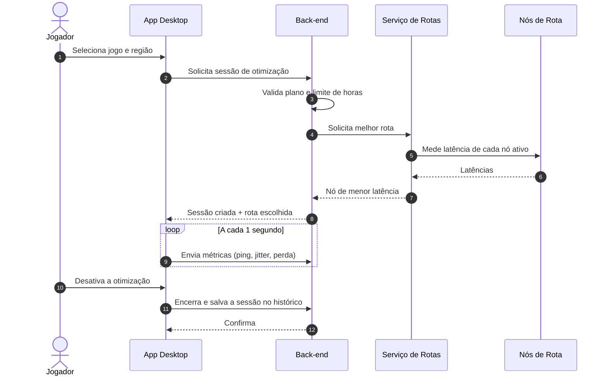
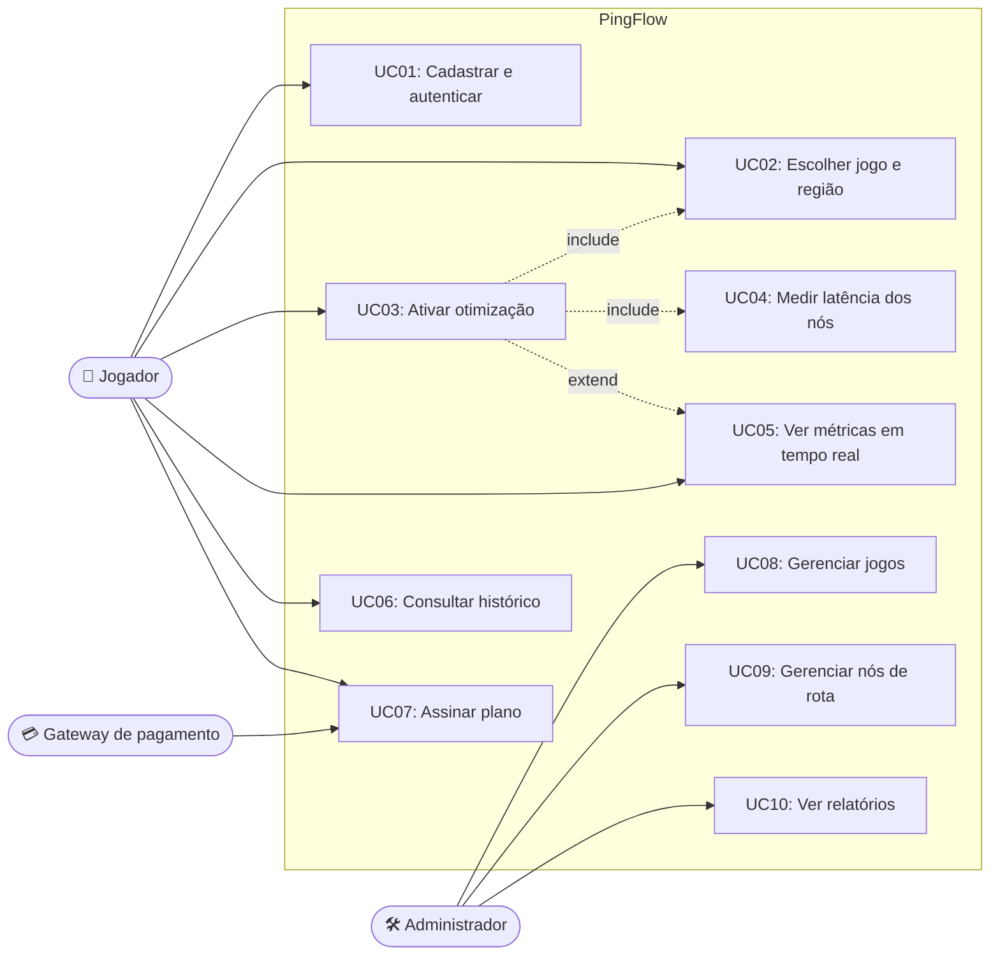
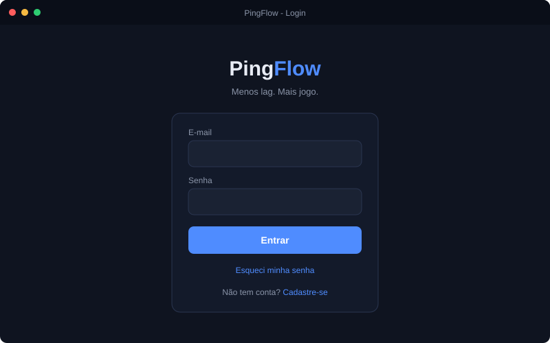
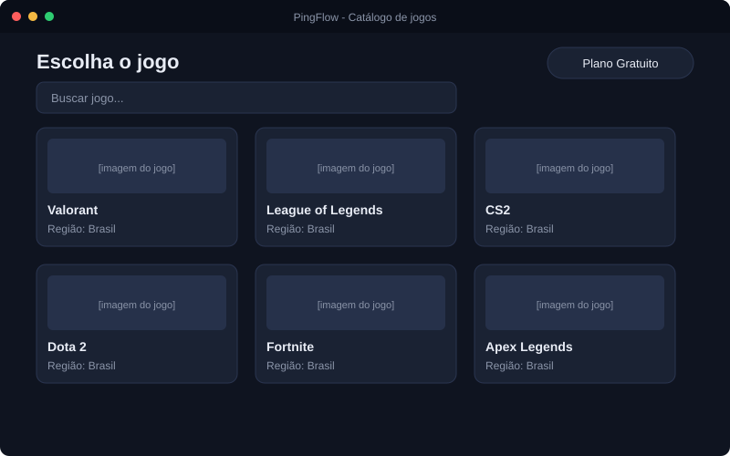
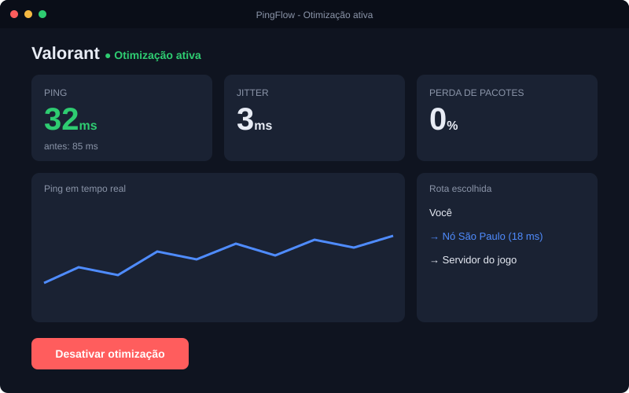
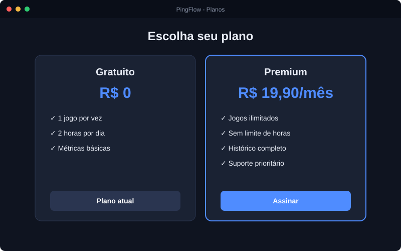

# 🚀 PingFlow — Otimizador de Conexão para Jogos Online

## 📖 Sobre o Projeto

O **PingFlow** é uma plataforma que **reduz o lag em jogos online**. Ele conecta o jogador a uma rede de nós intermediários e escolhe automaticamente o caminho com menor latência até o servidor do jogo, diminuindo ping, jitter e perda de pacotes.

Este repositório documenta todo o ciclo de engenharia de software do produto: requisitos, modelagem, metodologia ágil, arquitetura, protótipo e testes. O foco do trabalho é o **processo**, por isso não há código-fonte implementado.

**Autor:** Guilherme Gotardo Santana · **Curso:** Análise e Desenvolvimento de Sistemas (ADS) · **Disciplina:** Engenharia de Software

---

## 🎯 Objetivo

O principal objetivo é **melhorar a qualidade da conexão de jogadores com servidores de jogos online**, de forma simples e sem exigir conhecimento técnico.

A plataforma pretende:

- 🎮 Reduzir o ping em jogos online competitivos;
- 🛰️ Escolher automaticamente a melhor rota de conexão;
- 📊 Mostrar métricas de qualidade em tempo real;
- 🕒 Registrar o histórico de sessões do jogador;
- 💳 Oferecer planos gratuito e premium;
- 🛠️ Permitir que administradores gerenciem jogos e servidores;
- ⚡ Ativar a otimização em poucos cliques.

---

## ⚙️ Funcionalidades Principais

### 1. Autenticação e Perfil

- **Cadastro e login seguros:** e-mail e senha com hash, recuperação de senha por e-mail.
- **Preferências do jogador:** jogo e região favoritos salvos na conta.

### 2. Catálogo de Jogos e Regiões

- **Catálogo de jogos suportados:** lista com busca por nome.
- **Seleção de região:** o jogador escolhe a região do servidor do jogo.

### 3. Motor de Otimização de Rota

- **Medição de latência:** o sistema testa todos os nós de rota ativos.
- **Escolha automática:** a rota de menor latência é selecionada em até 5 segundos.
- **Ativar e desativar com um clique.**

### 4. Métricas e Histórico

- **Painel em tempo real:** ping, jitter e perda de pacotes atualizados a cada segundo.
- **Histórico de sessões:** data, jogo, duração e ping médio.

### 5. Planos e Administração

- **Planos Gratuito e Premium:** com limites e benefícios diferentes.
- **Painel administrativo:** gerenciamento de jogos, nós de rota e relatórios de uso.

---

## Diagramas de sequência e de caso de uso

Os demais diagramas (classes, atividades e DER) estão em [docs/03-modelagem.md](docs/03-modelagem.md).

---

## 🎨 Diretrizes de UI/UX

### 1. Interface de Usuário (UI) e Ergonomia Visual

- **Protagonismo da métrica:** o ping é o elemento principal da tela de otimização, em tamanho grande e com cor semântica (verde = bom, vermelho = ruim).
- **Minimalismo funcional:** tema escuro, pensado para quem joga por horas, sem distrações visuais.
- **Feedback instantâneo:** estados claros de conectando, ativo e desativado.

### 2. Usabilidade e Engajamento

- **Início rápido:** otimização iniciada em até 3 cliques.
- **Zero configuração:** a melhor rota é escolhida automaticamente.
- **Transparência:** o jogador vê a rota usada e o ping antes e depois.
- **Planos claros:** limites do plano gratuito sempre visíveis.

### 3. Protótipo de telas

| Login | Catálogo de jogos |
|:-----:|:-----------------:|
|  |  |

| Otimização ativa | Planos |
|:----------------:|:------:|
|  |  |

---

## 💳 Planos

| Recurso | Gratuito | Premium |
|---------|:--------:|:-------:|
| Jogos otimizados por vez | 1 | Ilimitados |
| Limite diário | 2 horas | Sem limite |
| Métricas em tempo real | ✅ | ✅ |
| Histórico completo | — | ✅ |
| Suporte prioritário | — | ✅ |

---

## 🛠️ Tecnologias

### **Cliente Desktop**

**Electron + React:** interface moderna com acesso a recursos do sistema operacional, como configurar a rota de rede. **TypeScript** evita erros comuns de tipagem.

### **Back-end & Infraestrutura**

**Node.js:** orquestra as APIs REST de autenticação, sessões, métricas e planos.

**PostgreSQL:** banco relacional sólido para usuários, assinaturas, pagamentos e histórico de sessões.

**Docker:** ambientes reproduzíveis para desenvolvimento e implantação.

**GitHub Actions:** integração contínua para validar a documentação e, futuramente, os testes.

---

## 🗓️ Roadmap do MVP

- [ ] **Milestone 1: Alinhamento, Design e Base do Projeto**
  - Requisitos, user stories, modelagem UML, protótipo no Figma, setup do repositório e do banco de dados.
- [ ] **Milestone 2: Núcleo do Aplicativo**
  - Cadastro, login, catálogo de jogos e painel administrativo de jogos.
- [ ] **Milestone 3: Motor de Otimização**
  - Medição de latência, escolha automática de rota e painel de métricas em tempo real.
- [ ] **Milestone 4: Planos e Pagamentos**
  - Assinatura Premium, integração com gateway de pagamento e controle de limites.
- [ ] **Milestone 5: Testes e Lançamento**
  - Testes de desempenho e segurança, correção de bugs, polimento de UI/UX e publicação da versão de teste.

---

## 📂 Documentação Complementar

| Documento | Conteúdo |
|-----------|----------|
| [Requisitos](docs/01-requisitos.md) | Requisitos funcionais, não funcionais e regras de negócio |
| [User Stories](docs/02-user-stories.md) | Histórias de usuário com critérios de aceite |
| [Modelagem](docs/03-modelagem.md) | Casos de uso, classes, sequência, atividades e DER |
| [Metodologia Ágil](docs/04-metodologia-agil.md) | Scrum, backlog, sprints e Definition of Done |
| [Plano de Testes](docs/05-plano-de-testes.md) | Estratégia e casos de teste |
| [Arquitetura](docs/06-arquitetura.md) | Visão arquitetural, decisões e riscos |
| [Guia de Contribuição](CONTRIBUTING.md) | Fluxo de trabalho, branches e commits |

---

## 👥 Equipe

| Integrante | Função |
|------------|--------|
| [SEU NOME] | Product Owner, Scrum Master e Desenvolvedor |

---

## 📄 Licença

Distribuído sob a licença MIT. Veja [LICENSE](LICENSE).
