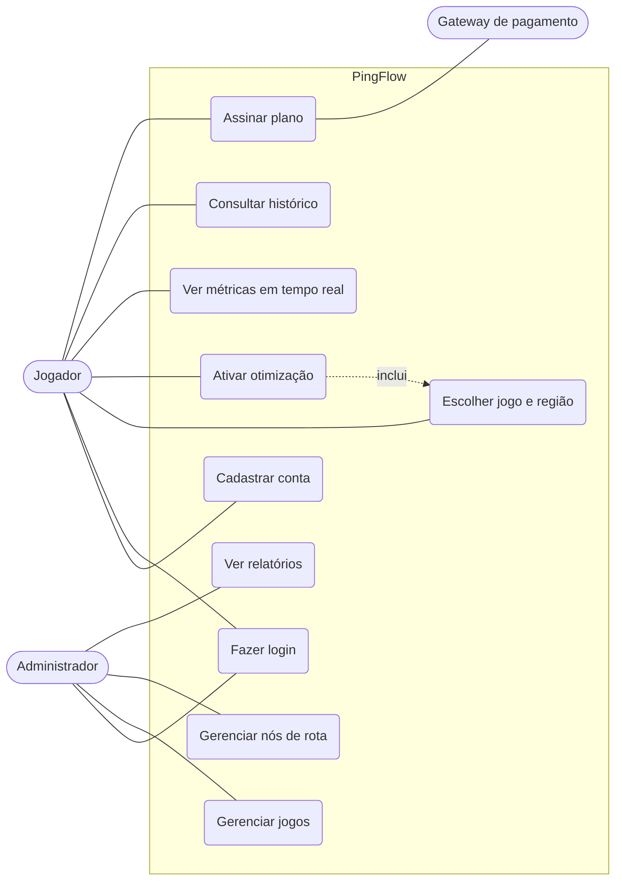
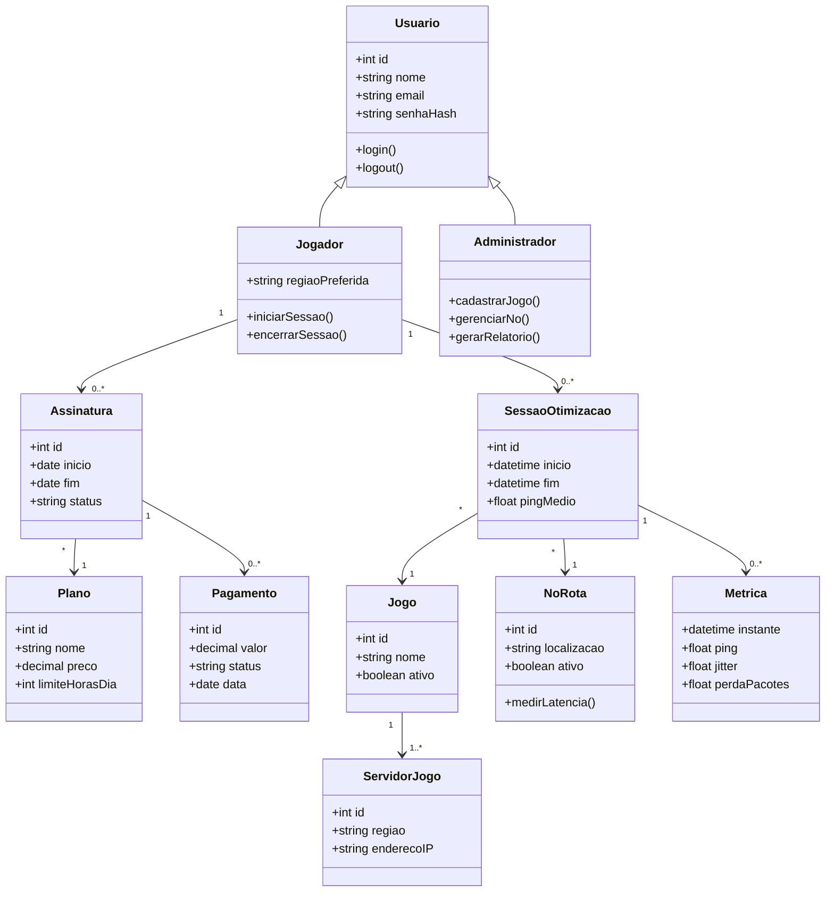
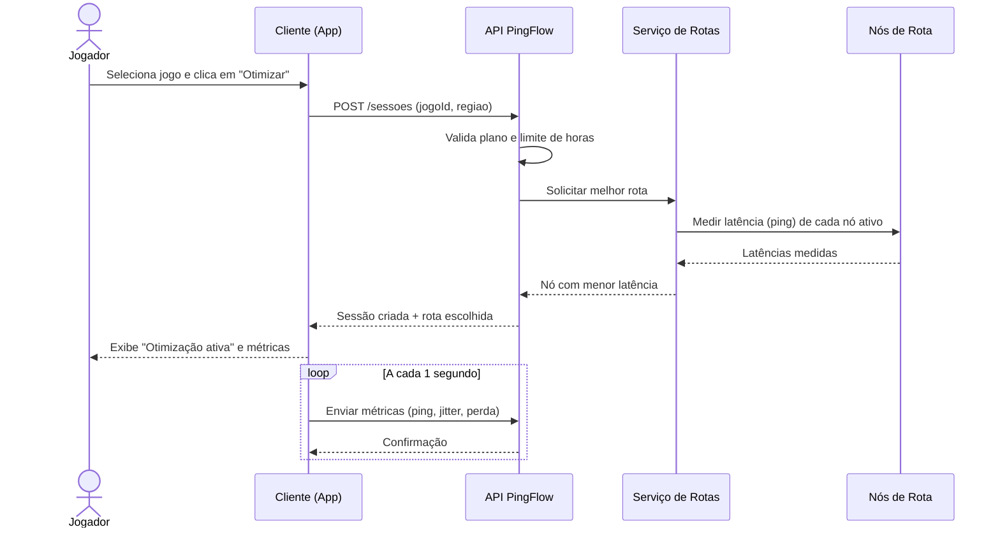
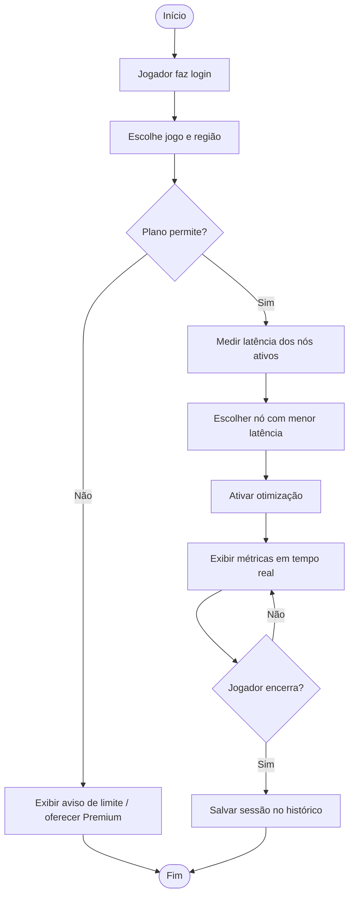
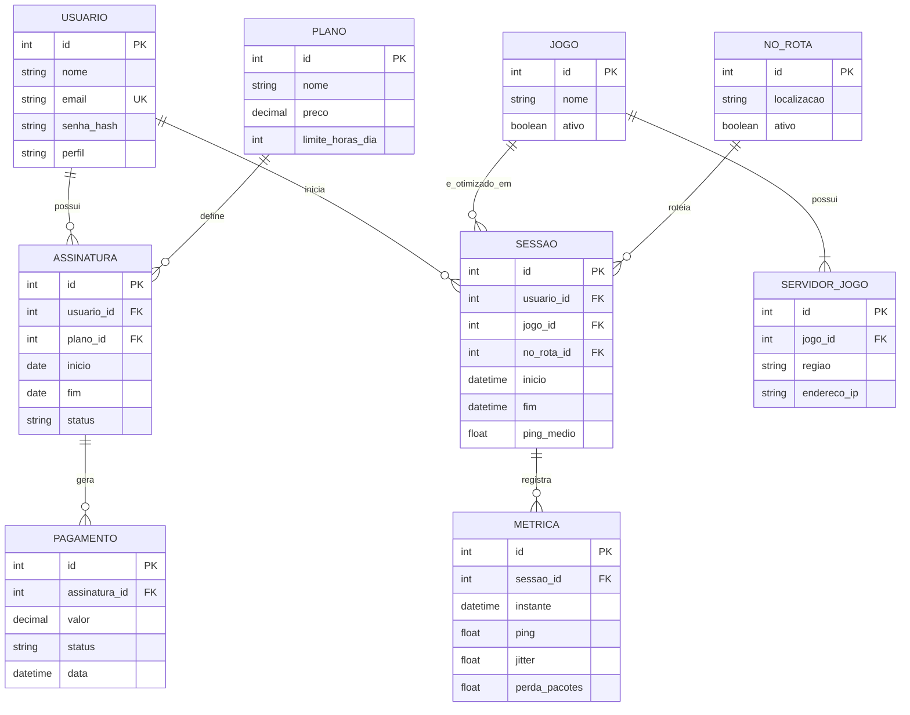

# Modelagem do Sistema

Os diagramas abaixo usam **Mermaid**, que o GitHub renderiza automaticamente.

## 1. Diagrama de Casos de Uso

## 2. Diagrama de Classes

## 3. Diagrama de Sequência: Ativar otimização

## 4. Diagrama de Atividades: Fluxo de otimização

## 5. Modelo Entidade-Relacionamento (DER)

