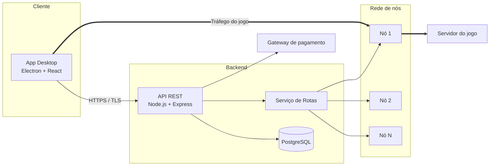

# Arquitetura

## 1. Visão geral

Arquitetura **cliente-servidor em camadas**, com serviços separados para API, rotas e pagamentos.

## 2. Camadas da API

| Camada | Responsabilidade |
|--------|------------------|
| Controllers | Receber requisições HTTP e devolver respostas |
| Services | Regras de negócio |
| Repositories | Acesso ao banco de dados |
| Models | Entidades do domínio |

## 3. Decisões arquiteturais (ADR resumido)

| # | Decisão | Motivo | Alternativa descartada |
|---|---------|--------|------------------------|
| 1 | API REST com JSON | Simples e amplamente suportada | GraphQL (complexidade desnecessária) |
| 2 | PostgreSQL | Dados relacionais e transações para pagamentos | MongoDB |
| 3 | JWT para autenticação | Sem estado, escala bem | Sessões em servidor |
| 4 | Docker | Ambientes reproduzíveis | Instalação manual |
| 5 | Serviço de rotas separado | Escalar a medição de latência de forma independente | Tudo na API |

## 4. Segurança
- TLS em toda comunicação
- Senhas com bcrypt
- Tokens JWT com expiração curta e refresh token
- Limite de tentativas de login (rate limiting)
- Dados pessoais tratados conforme a LGPD

## 5. Riscos

| Risco | Probabilidade | Impacto | Mitigação |
|-------|--------------|---------|-----------|
| Nó de rota fora do ar | Média | Alto | Redundância e health checks |
| Latência adicional acima do limite | Média | Alto | Monitoramento e testes de desempenho |
| Vazamento de dados | Baixa | Alto | Criptografia e boas práticas de segurança |
| Jogos que bloqueiam proxies | Média | Médio | Catálogo apenas de jogos homologados |
